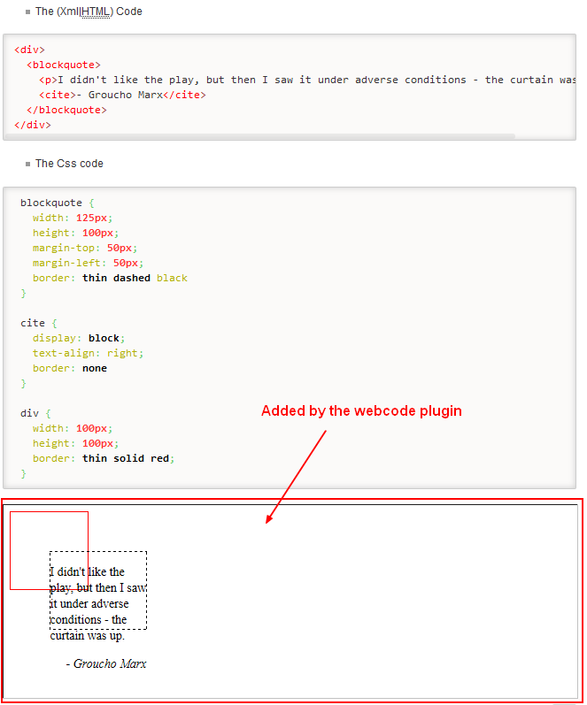

# Webcode component (Render HTML, Javascript and CSS)

## Usage

The [Webcode component](https://combostrap.com/webcode)  renders the output of:

  * CSS
  * HTML
  * [Javascript](#javascript) or [Babel](#babel)
  * Dokuwiki

code block.

By enclosing code block by a `<webcode>` block, the plugin will add the result after the last webcode tag.

See the [webcode documentation](https://combostrap.com/webcode)

## Example

See the plugin in action [here](https://combostrap.com/webcode).

## Illustration



## Installation

Install the plugin using:

  * the [Plugin Manager](https://www.dokuwiki.org/plugin:plugin)
  * [manually](https://www.dokuwiki.org/plugin:Plugins) with the [download URL](http://github.com/gerardnico/dokuwiki-plugin-webcode/zipball/master), which points to latest version of the plugin.


## Road map

  * Allow Runkit (This [code](https://gerardnico.com/web/javascript/node/script#browser) works on JsFiddle but not in webcode ) may be cause by the restrictions. See below.
```html
<iframe name="result" allow="midi *; geolocation *; microphone *; camera *; encrypted-media *;"
sandbox="allow-modals allow-forms allow-scripts allow-same-origin allow-popups allow-top-navigation-by-user-activation" allowfullscreen="" allowpaymentrequest="" frameborder="0" src="">
 </iframe>
```
  * More language with:
     * [sphere-engine](https://developer.sphere-engine.com/api/compilers) - Online example: https://ideone.com
     * or [codingground](https://www.tutorialspoint.com/codingground.htm
     * [Glot.io](https://github.com/prasmussen/glot)
  * [Mermaid Graph Library](https://mermaidjs.github.io) as language
  * Add the console after initial rendering to not select console element via css

## Technically

Technically, the plugin:

  * parses the content between the two `<webcode>` tag,
  * extracts the html, css and javascript code,
  * adds after the last webcode tag an [iframe](https://docs.webplatform.org/wiki/html/elements/iframe),
  * and a button that permits to play with the code on [JsFiddle](https://jsfiddle.net)


## Changes

### 2021-02-02

  * The bar (`rendered by` and `Try the code`) are now less prominent and follows the [prism style](https://prismjs.com/plugins/toolbar/)
  * The documentation has moved to ComboStrap.

### 2020-05-27

  * Added the possibility to show dokuwiki code if the language extension is dw
  * Bug: the babel term was replaced by Javascript also in the code. It should be only on the code definition.
  * Bug: trElement was declared two times in two different scope causing problem
  * Added the possibility to cache a code block
  * Webcode has been restructured (with the use of addPattern) and can now wrap headers (level, section). It can then be used for a howto page.
  * Automatic test and travis has been added

### 2019-05-14

  * Firebug console was not added when the language was Babel
  * The output on the console log is now escaped for HTML entities and can then render HTML
  * There was a bug with the declaration of a variable

### 2019-02-06

  * To be able to see the output of a `console.log` javascript statement in JsFiddle, the firebug resources have been added (The JsFiddle feature was broken)
  * New publication date on Dokuwiki

### 2017-10-22

  * Added a `renderingMode` argument to be able to show only the result
  * Added a promotion link
  * The links are now after the result.
### 2017-08-05

  * The 'console.table' function is partially supported
  * The 's' variable leaked from the window.console.log function of the webCodeConsole.js

### 2017-06-07

  * The height of the Iframe is now dynamically calculated. No need to give this attribute anymore if you want to see the whole output.

### 2017-04-28

  * Added [Babel](https://babeljs.io/) support
  * Bugs (Https call to Fiddle in place of Http, externalAttributes Resources in the action bar in place of include, Xml was not replaced by HTML code)
  * Cache bursting implementation for the weCodeConsole.(js|css) file so that they are not cached for an new version.
  * New lines (\n) are now supported in the javascript console.log function.
  * Object of one level are now supported in the javascript console.log function.
  * [JSFiddle bug 726](https://github.com/jsfiddle/jsfiddle-issues/issues/726) makes the resources order not consistent. Solution: More than one resources will be then added in the HTML script element.
### 2017-10-1
  * Two block of the same code are now concatenated
  * Jquery is no more used. It was used for the javascript part of the console functionality.
  * XML is now seen as HTML
  * The ''name''
